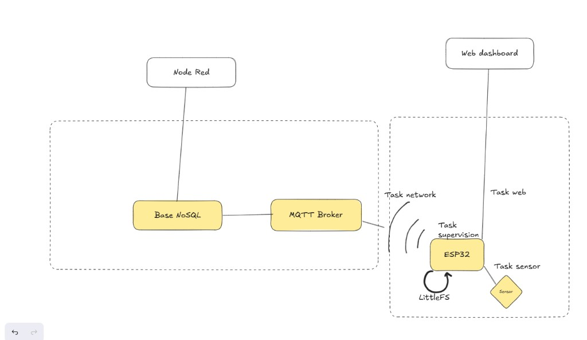

# Rapport technique — IoT Secure Station

**TP Master II — Système IoT sécurisé et autonome**  
**Équipe : 2 développeurs** (firmware embarqué + infrastructure & supervision)  
**Date : juin 2026**

---

## 1. Contexte et objectifs

Une société déploie des stations IoT dans des bâtiments techniques. Ces stations doivent acquérir des données environnementales, continuer à fonctionner en cas de perte réseau, communiquer avec un serveur central, rester configurables localement et résister aux erreurs et usages malveillants.

Notre équipe a conçu une solution complète composée de :

- un **firmware ESP32** modulaire, multitâche (FreeRTOS), avec interface web embarquée ;
- une **infrastructure de supervision** conteneurisée (Mosquitto, Node-RED, InfluxDB) permettant l’historisation et la visualisation centralisée des mesures.

### Objectifs fonctionnels atteints

| Objectif | Réalisation |
|----------|-------------|
| Acquisition multi-capteurs | DHT22 (température/humidité), potentiomètre, bouton poussoir |
| Commande d’actionneurs | LED (GPIO 5) et relais (GPIO 26), règle automatique sur seuil de température |
| Publication MQTT | Topic `campus/g1/esp32-1/data`, QoS 1, authentification |
| Mode offline | Buffer JSONL sur LittleFS, rejeu automatique à reconnexion |
| Interface web locale | Dashboard live, config MQTT persistante (NVS), commandes actionneurs |
| Supervision Node-RED | Ingest, validation, stockage InfluxDB, dashboard (jauges + courbes historiques) |
| Sécurité | Auth MQTT, validation JSON, protection API locale |
| Optimisation | Logs périodiques : heap libre, uptime, latence de publication |

### Matériel retenu

La configuration minimale imposée par le cahier des charges prévoit un BME280 ; nous avons retenu un **DHT22** (équivalent fonctionnel pour température/humidité), un **potentiomètre** (ADC GPIO 34), un **bouton poussoir** (GPIO 27, pull-up interne), une **LED** et un **relais**. Le câblage est centralisé dans `config.h` pour faciliter l’adaptation au montage final.

---

## 2. Architecture globale

### 2.1 Vue d’ensemble



*Figure 1 — Architecture globale : l’ESP32 exécute quatre tâches FreeRTOS (capteurs, réseau, web, supervision), persiste les mesures en mode offline via LittleFS, expose un dashboard web local et communique avec le broker MQTT. Node-RED ingère les messages, alimente la base NoSQL (InfluxDB) et affiche le dashboard de supervision.*

Le fichier source éditable du diagramme est disponible dans `docs/architecture.drawio`.

### 2.2 Répartition des responsabilités

| Composant | Rôle |
|-----------|------|
| **Mosquitto** | Transport temps réel, authentification, pas de persistance historique |
| **Node-RED** | Ingest MQTT, validation du schéma JSON, écriture InfluxDB, dashboard temps réel et historique |
| **InfluxDB 1.x** | Base NoSQL temporelle (measurement `sensors`, tag `device`) |
| **Firmware ESP32** | Acquisition, filtrage, buffer offline, web local, exécution des commandes |

### 2.3 Conventions MQTT

| Topic | Direction | Usage |
|-------|-----------|-------|
| `campus/<groupe>/<deviceID>/data` | ESP32 → serveur | Mesures capteurs |
| `campus/<groupe>/<deviceID>/cmd` | serveur → ESP32 | Commandes actionneurs |
| `campus/<groupe>/<deviceID>/alerts` | serveur | JSON rejeté ou alertes |

Format JSON imposé pour les mesures :

```json
{
  "device": "esp32-1",
  "ts": 1718440000123,
  "data": {
    "temp": 21.5,
    "humidity": 60.0,
    "potentiometer": 42,
    "button": 0,
    "outlier": 0
  }
}
```

Le champ `ts` est exprimé en millisecondes epoch (via NTP) ou, en fallback, en `millis()` depuis le boot. Node-RED normalise ce timestamp pour l’écriture InfluxDB, ce qui garantit un historique cohérent même après un rejeu offline.

---

## 3. Firmware ESP32

### 3.1 Structure modulaire

Le code respecte l’arborescence imposée :

```
esp32-firmware/src/
  main.cpp              # Initialisation, démarrage des tâches, loop() vide
  config.h              # Broches, intervalles, priorités FreeRTOS
  sensors/              # Acquisition DHT22, filtrage, partage thread-safe
  actuators/            # LED, relais, règle automatique température
  network/              # WiFi, MQTT, NTP, rejeu offline
  storage/              # File d’attente JSONL LittleFS
  web/                  # Serveur HTTP, API REST, assets embarqués
  security/             # Validation JSON, auth API, config NVS
  supervision/          # Métriques système périodiques
```

**Contraintes respectées :** aucune logique métier dans `loop()` (seul un `vTaskDelay(portMAX_DELAY)`), aucun `delay()` bloquant — tous les temporisateurs passent par `vTaskDelay`.

### 3.2 Multitâche FreeRTOS

Quatre tâches dédiées tournent sur les deux cœurs de l’ESP32 :

| Tâche | Core | Priorité | Pile | Intervalle | Rôle |
|-------|------|----------|------|------------|------|
| `sensor` | 1 | 2 | 4 Ko | 2 s | Lecture capteurs, filtrage, mise à jour partagée |
| `web` | 1 | 2 | 10 Ko | 50 ms | `handleClient()`, API REST |
| `network` | 0 | 3 | 8 Ko | 5 s | WiFi, MQTT, publication, rejeu |
| `supervision` | 0 | 1 | 4 Ko | 10 s | Uptime, heap, latence MQTT |

La **tâche réseau** a la priorité la plus élevée pour maintenir la connectivité et traiter les messages MQTT entrants sans latence excessive. Les données capteurs sont partagées via un mutex (`sensor_data.cpp`) entre la tâche d’acquisition et les consommateurs (réseau, web).

### 3.3 Acquisition et filtrage capteurs

La tâche `sensor` implémente trois mécanismes de robustesse :

1. **Moyenne glissante** (fenêtre de 5 échantillons) sur température et humidité DHT22, pour lisser le bruit de mesure.
2. **Détection de pics anormaux** : rejet si variation > 4 °C ou > 15 % d’humidité par rapport à la dernière mesure valide ; le flag `outlier` est propagé dans le JSON publié.
3. **Fallback** : en cas d’échec de lecture DHT22, conservation de la dernière valeur valide (évite des trous dans la série temporelle).

Le potentiomètre est lu en 12 bits (0–4095 → 0–100 %) et le bouton en pull-up interne (actif à l’état bas).

Horodatage : synchronisation NTP (`pool.ntp.org`, resync toutes les heures) avec repli sur `millis()` si le réseau n’est pas disponible au démarrage.

### 3.4 Actionneurs

Deux sorties numériques sont pilotées :

- **LED** (GPIO 5) : commandable via l’interface web embarquée ou le topic MQTT `cmd`, ou automatiquement si la température dépasse un seuil configurable (défaut 30 °C, plage 10–50 °C, persisté en NVS).
- **Relais** (GPIO 26) : commande ON/OFF uniquement.

Les commandes acceptées sont strictement limitées à : `led_on`, `led_off`, `relay_on`, `relay_off`. Toute commande manuelle désactive le mode auto-LED.

### 3.5 Communication réseau (MQTT)

La tâche `network` gère :

- **WiFi STA** avec reconnexion automatique, scan diagnostique et mode **AP de secours** (`esp32-esp32-1`, mot de passe `iotsecure`) pour accéder à l’interface web même sans routeur.
- **MQTT** via la librairie `256dpi/MQTT`, buffer 1024 octets, keep-alive 60 s, **QoS 1** obligatoire pour publish et subscribe.
- **Authentification** : identifiants lus depuis `secrets.h` (défaut) ou NVS (configurés via l’interface web).
- **Abonnement** au topic `campus/g1/esp32-1/cmd` pour recevoir les commandes distantes.
- **Publication** toutes les 5 s si une nouvelle mesure est disponible (déduplication par timestamp).

En cas d’échec de publication, la mesure est **enqueue** dans le buffer offline. À la reconnexion MQTT, `storageFlush()` republie les lignes en ordre FIFO.

### 3.6 Mode offline (LittleFS)

Le module `storage/` implémente une file d’attente persistante :

- Fichier : `/offline_queue.jsonl` (une ligne JSON par mesure).
- Taille max : 32 Ko ; si plein, la ligne la plus ancienne est supprimée (politique FIFO).
- Accès protégé par mutex FreeRTOS (partagé avec le serveur web pour LittleFS).
- Au flush : validation JSON ligne par ligne, republication QoS 1, conservation des entrées non publiées en cas d’échec partiel.

Ce mécanisme satisfait le badge **Reliability Engineer** : la station survit à une coupure broker sans perte de données (dans la limite de la capacité flash).

### 3.7 Interface web embarquée

L’interface (`data/index.html`, `app.js`, `style.css`) est **embarquée dans le firmware** via le script `scripts/embed_web.py` (build PlatformIO). Un seul `pio run -t upload` suffit.

Fonctionnalités :

- Affichage live des capteurs et de l’état WiFi/MQTT (polling REST).
- Configuration MQTT (broker, port, user, password) avec persistance NVS.
- Commandes LED/relais et réglage du seuil de température.
- Métriques système : uptime, heap libre, latence de publication.

**API REST exposée :**

| Route | Méthode | Description |
|-------|---------|-------------|
| `/api/status` | GET | État global (WiFi, MQTT, actionneurs, métriques) |
| `/api/sensors` | GET | Dernière mesure capteurs |
| `/api/config` | GET/POST | Lecture/écriture config MQTT |
| `/api/actuators` | POST | Commande actionneur |
| `/api/threshold` | GET/POST | Seuil LED automatique |

---

## 4. Infrastructure de supervision

### 4.1 Stack Docker

Trois services sont orchestrés via `docker/docker-compose.yml` :

| Service | Image | Ports | Rôle |
|---------|-------|-------|------|
| Mosquitto | `eclipse-mosquitto:2` | 1883, 9001 | Broker MQTT authentifié |
| InfluxDB | `influxdb:1.8` | 8086 | Historique temporel (base `iot`) |
| Node-RED | `nodered/node-red:latest` | 1880 | Flux de supervision + dashboard |

Les identifiants MQTT et InfluxDB sont externalisés (`docker/.env`, non versionné). Les hash Mosquitto sont versionnés dans `docker/mosquitto/config/passwd`.

### 4.2 Flux Node-RED

Le flux (`node-red/flows.json`) a été refactorisé pour privilégier la **visualisation des données** (commit `refactor: update Node-RED flow for improved UI and data visualization`). Il implémente la chaîne suivante :

1. **Ingest** : abonnement `campus/+/+/data` (QoS 1).
2. **Validation** : nœud Function vérifie le schéma `{ device, ts, data }`, filtre les champs numériques, normalise le timestamp (secondes ou millisecondes → epoch ms). Les timestamps non epoch (ex. `millis()` sans NTP) sont remplacés par l’heure serveur pour éviter des points incohérents en base.
3. **Stockage** : écriture batch InfluxDB (measurement `sensors`, tag `device`, fields dynamiques : `temp`, `humidity`, `potentiometer`, etc.).
4. **Dashboard** (`http://localhost:1880/ui`) — deux groupes :
   - **Mesures en direct** : jauges température (0–50 °C) et humidité (0–100 %), texte « Dernière mesure » (device + heure).
   - **Historique** : deux graphiques linéaires (`ui_chart`) alimentés par le flux MQTT live, fenêtre glissante de **1 heure**, avec légende par topic (`Température`, `Humidité`). L’humidité est bornée à 0–100 % sur l’axe Y.
5. **Alertes** : JSON invalide republié sur `campus/<g>/<dev>/alerts` (QoS 1), avec log dans la sidebar Node-RED.

Les nœuds `node-red-dashboard` et `node-red-contrib-influxdb` restent requis dans le conteneur (installation npm documentée dans `docs/suivi-projet.md`).

### 4.3 Commandes distantes

Le firmware reste abonné au topic `campus/g1/esp32-1/cmd` (QoS 1) et accepte les payloads :

```json
{ "action": "led_on" }
```

ou le format alternatif :

```json
{ "cmd": "led", "value": "on" }
```

Actions supportées : `led_on`, `led_off`, `relay_on`, `relay_off`.

Le dashboard Node-RED ne propose **plus de boutons de commande** depuis le refactor UI : le pilotage des actionneurs est assuré par l’**interface web embarquée** (`POST /api/actuators`) et, si besoin, par publication manuelle sur le topic MQTT `cmd` (client Mosquitto, simulateur, etc.). La validation côté ESP32 rejette toute action hors liste blanche.

---

- Finaliser le câblage matériel réel selon la station finale
- Compléter les preuves de démo (captures/vidéo)
- Bonus Grafana à intégrer (hors périmètre immédiat)
